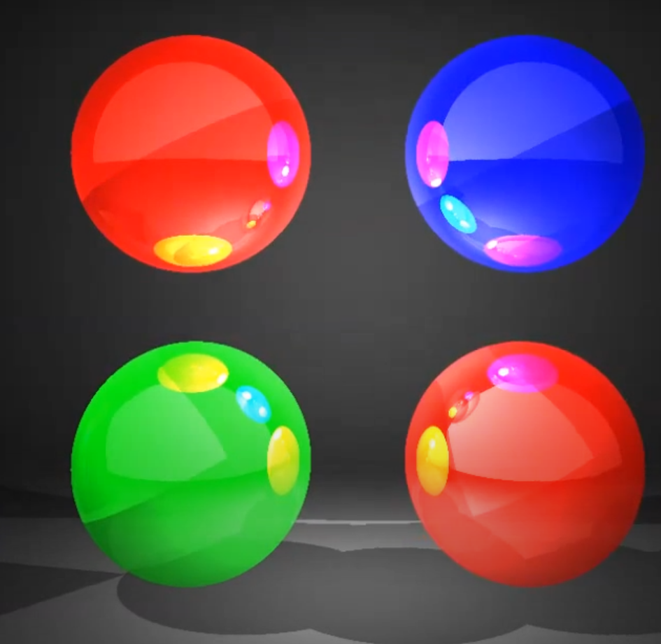
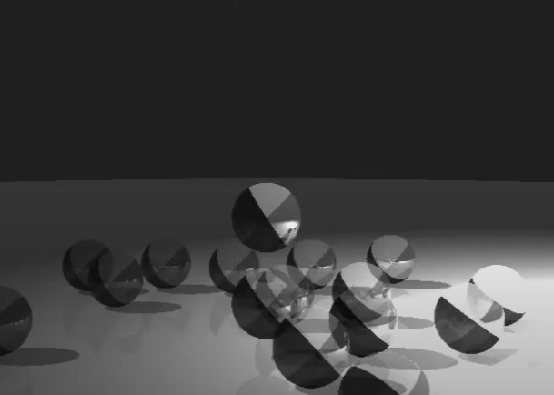
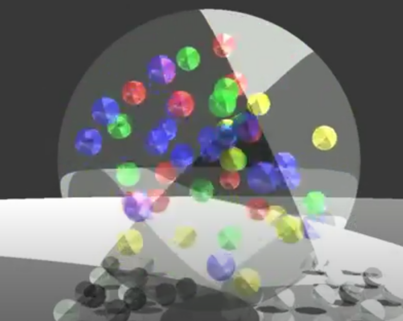

# [개인] CG 수업 프로젝트

**프로젝트 명**: Ray Tracing으로 구/평면 렌더링
**진행 기간 **: 2015. 04. ~ 2015. 06.
**사용 언어/기술**: C++. 별도 라이브러리 없이, Ray 반사 계산함.

**소개**
색을 가지는 구 또는 폴리곤 기반 평면의 물체들과 카메라를 특정 좌표에 배치하고,
화면 (1280\*960)의 각 픽셀마다 빛을 쏘아서 물체에 부딪히면 얻게되는 색과 반사되어 얻게되는 색들을 조합해 렌더링 시킨다.
반사 최대 횟수는 4번 내외이며 또한, 불투명한 물체에 부딪히면 반사를 시키지 않는다.

**스크린샷**

